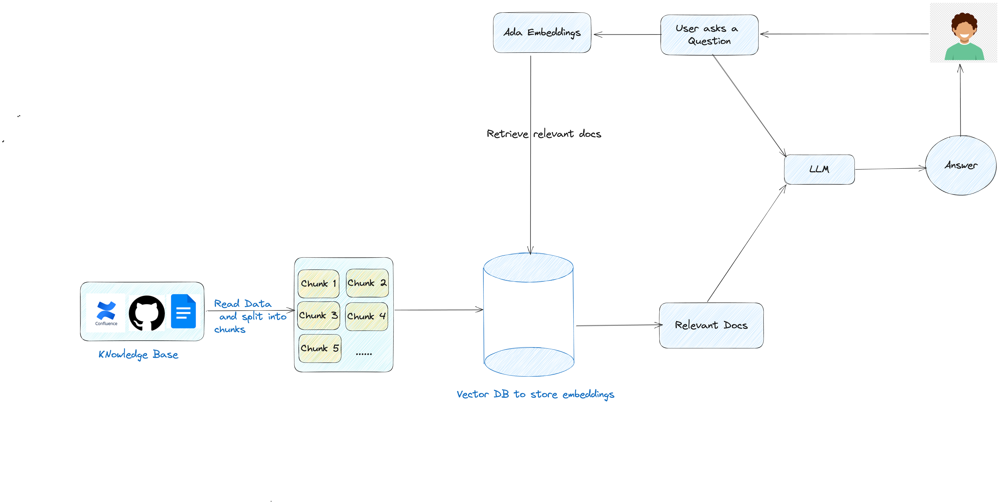
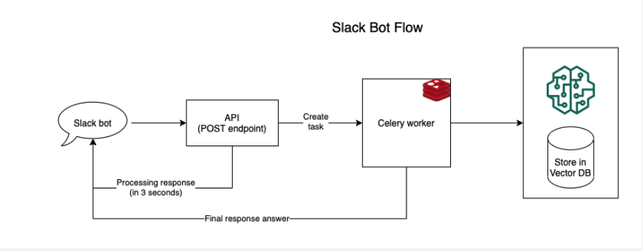

# Info-GPT

Information retrieval on your private data using Embeddings Vector Search and LLMs.


## Architecture



## Slack bot flow


#### QA ChatBot

1. The data is first scraped from the internal sources.
2. The text data is then converted into embedding vectors using pre-trained models.
3. These embeddings are stored into a Vector database, we have used [Chroma](https://www.trychroma.com/) in this project. Vector databases allows us to easily perform Nearest Neighbor Search on the embedding vectors.
4. Once all data is ingested into the DB, we take the user query, fetch the top `k` matching documents from the DB and feed them into the LLM of our choice. The LLM then generates a summarized answer using the question and documents. This process is orchestrated by Langchain's `RetrievalQA` [chain](https://python.langchain.com/en/latest/modules/chains/index_examples/vector_db_qa.html)

#### Slack Bot

1. The package also has an `api` folder which can be used to integrate it as a Slack [slash command](https://api.slack.com/interactivity/slash-commands).
2. The API is built using **FastAPI**, which provides a `/slack` POST endpoint, that acts as URL for slack command.
3. Since the slash command has to response within `3 seconds`, we offload the querying work to **Celery** and return processing response to user.
4. Celery then performs the retrieval and summarization task on the query and sends the final response to the Slack provided endpoint.

## Installation

#### Install using pip

The package can be easily installed by `pip`, using the following command:

```bash
pip install info_gpt[api] git+https://github.com/techytushar/info_gpt
```

#### Development install

1. This package uses **Poetry** for dependency management, so install poetry first using instructions [here](https://python-poetry.org/docs/#installation)
2. *[Optional]* Update poetry config to create virtual environment inside the project only using `poetry config virtualenvs.in-project true`
3. Run `poetry install --all-extras` to install all dependencies.
4. Install the `pre-commit` hooks for linting and formatting using `pre-commit install`

## Usage

All configurations are driven through the `constants.py` and `api/constants.py`. Most of them have a default value but some need to be provided explicitly, such as secrets and tokens.
#### Data ingestion
```python
from info_gpt.ingest import Ingest
import asyncio

ingester = Ingest()
# ingest data from GitHub
asyncio.run(ingester.load_github("<org_name_here>", ".md"))
# ingest data from Confluence pages
ingester.load_confluence()
```

#### Run API locally
1. Build the Docker image locally using `docker build --build-arg SLACK_TOKEN=$SLACK_TOKEN -t info-gpt .`
2. Run the API using Docker Compose `docker compose up`
3. You can use [ngrok](https://ngrok.com/) to expose the localhost URL to internet using `ngrok http 8000 --host-header="localhost:8000"`

## Deployment

#### Deploy on K8s using Helm chart
---- WIP ----
